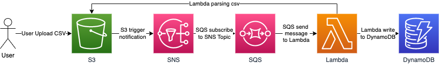

# CSV TO DYNAMODB 

### **Requirements**

1. [AWS CLI installed](https://docs.aws.amazon.com/cli/latest/userguide/getting-started-install.html)
2. [Configure AWS CLI](https://docs.aws.amazon.com/cli/latest/userguide/cli-configure-quickstart.html#cli-configure-quickstart-config)
3. [Terraform installed](https://learn.hashicorp.com/tutorials/terraform/install-cli) or [Download Terraform](https://www.terraform.io/downloads)
4. [Serverless Framework installed](https://www.serverless.com/framework/docs/getting-started)
> Use sudo if you experience issue installing Serverless Framework on linux
### **What We Want to Create**



Flow :
1. User upload csv file to S3 bucket 
2. S3 will trigger notification to SNS
3. SQS subscribe to SNS Topic, and will send message to Lambda
4. Lambda will triggered by SQS to read csv file then write to DynamoDB

### **How To**
1. Clone repository
```
git clone https://github.com/ludesdeveloper/csv-to-dynamodb.git
```
2. Change directory to csv-to-dynamodb
```
cd csv-to-dynamodb/
```
3. Init Terraform
```
terraform init
```
4. Apply Terraform
```
terraform apply -input=false -auto-approve
```
5. Change directory to python script located (Serverless Framework)
```
cd files/aws-python-project/
```
>You need to change root_id arn in file serverless.yml(just search for root_id inside serverless.yml)
7. Login to Serverless Framework
```
sls login
```
8. Deploy Serverless Framework
```
sls deploy
```
### **Testing**
> There is example file you can upload to bucket S3 to testing if it works or not (example.csv).
After upload to S3, you can check in you DynamoDB if there is any new data added there 
### **Cleaning Up**
1. In aws-python-project issue this command
```
sls remove
```
2. Change directory to root directory
```
cd ../..
```
3. Destroy Terraform
```
terraform destroy -input=false -auto-approve
```

